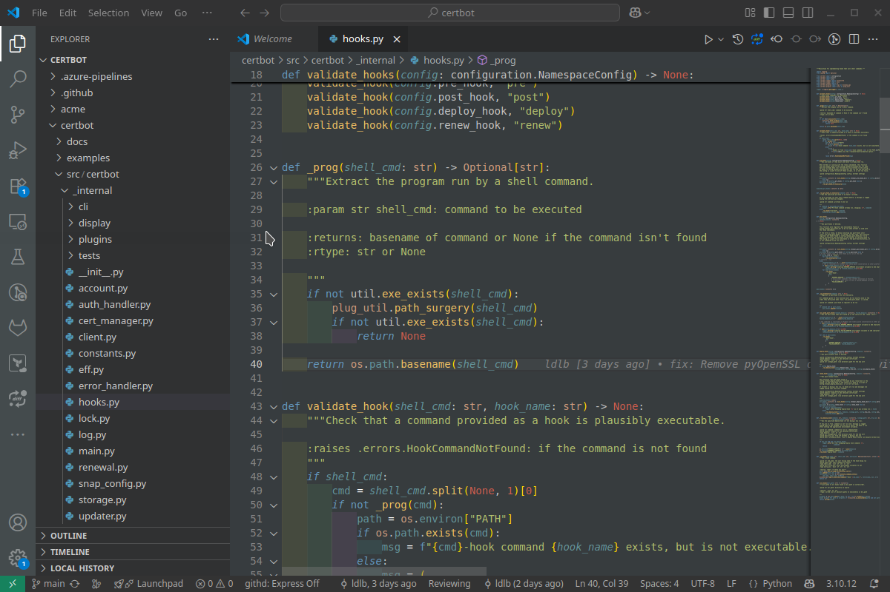

# SemiDark Theme for VS Code

https://marketplace.visualstudio.com/items?itemName=iskrant.semidark-theme

Dimmed Dark theme for VS Code.

Calm syntax highlight color scheme without bright tones.

# 
 No Light.  No Dark. In Balance

### 
Pretty color scheme.

# Build:

nvm install --lts && nvm use --lts && node -v && npm install -g @vscode/vsce && vsce package

# Install if You bild this yourself.
code --install-extension  semidark-theme-0.0.8.vsix